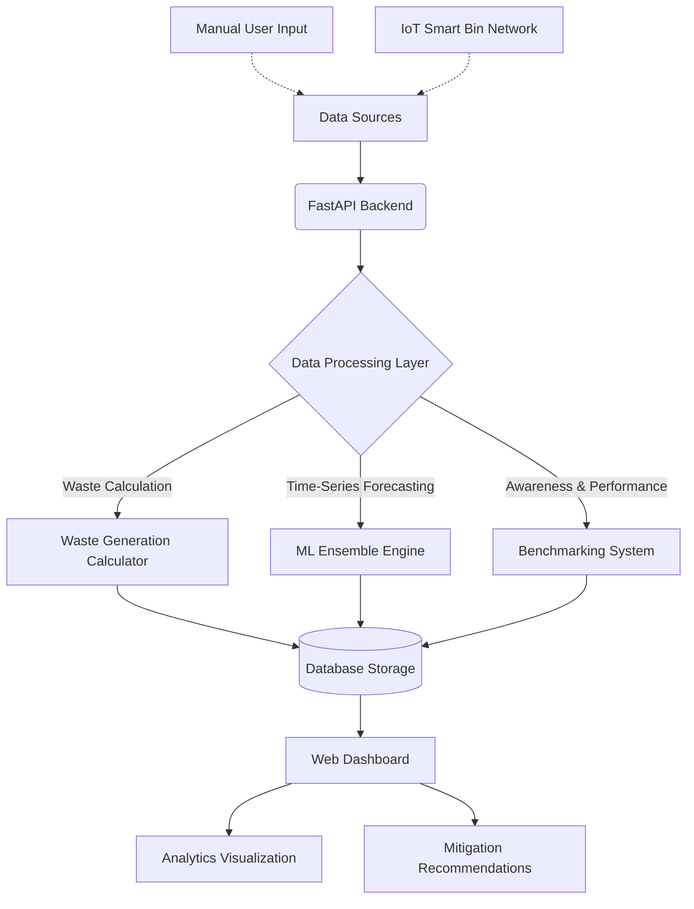

# AI-Powered Waste Management Awareness System

A comprehensive web-based platform designed to track, predict, and optimize waste generation while raising environmental awareness. Designed for individuals, institutions, and corporate operations, the system bridges the gap between raw waste data and actionable mitigation strategies.

## System Workflow

The following flowchart illustrates the architecture and data processing pipeline of the Waste Management Awareness System:



## Features

### Core Functionality
- **Multi-User Support**: Dedicated modules for Individual, Institution, and Corporation user types.
- **Waste Calculator**: Comprehensive calculation across organics, recyclables, e-waste, hazardous, and corporate waste.
- **Personalized Recommendations**: AI-powered awareness and sustainability feedback tailored to specific waste categories.
- **Interactive Dashboard**: Real-time visualization of waste generation trends and reduction milestones.
- **Historical Tracking**: Monitor waste output over time and measure mitigation improvements.

### Research-Grade Features
- **Machine Learning Predictions**: Ensemble models (Random Forest and Gradient Boosting) for forecasting future waste generation.
- **IoT Sensor Integration**: Real-time smart bin network simulation for continuous environmental monitoring.
- **Comparative Benchmarking**: Statistical comparison against industry standards using percentile analysis and effect size metrics.
- **Predictive Analytics**: Time-series forecasting with robust confidence intervals and trend analysis.
- **Advanced Analytics**: Awareness ratings and improvement potential quantification.
- **Research Reports**: Comprehensive reporting generation with statistical analysis and predictive insights.

## Architecture & Technology Stack

- **Backend**: FastAPI (Python)
- **Machine Learning Framework**: Scikit-learn (CPU-optimized, no GPU required)
- **Database**: SQLite (Designed with SQLAlchemy for seamless transition to PostgreSQL)
- **Frontend**: HTML5, CSS3, Vanilla JavaScript Dashboard with Chart.js

## Installation and Setup

1. Clone the repository and navigate to the project directory:
```bash
git clone https://github.com/aryawadhwa/WasteAware.git
cd WasteAware
```

2. Install dependencies:
```bash
pip install -r backend/requirements.txt
```

3. Initialize the database schema:
```bash
cd backend
python init_db.py
```

4. Start the application server:
```bash
python main.py
```
Alternatively, run with Uvicorn directly:
```bash
uvicorn main:app --reload --host 0.0.0.0 --port 8000
```

5. Access the web application:
- Navigate to `http://localhost:8000` in your web browser.
- Register a new account or authenticate an existing session.

## License

This project is licensed under the MIT License.
