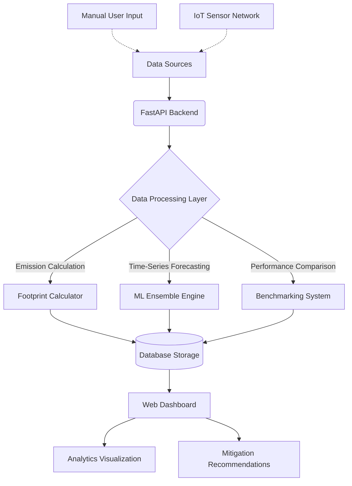

# CarbonCALC: Real-Time Carbon Footprint Monitoring and Predictive Reporting Cloud Solution

A comprehensive web-based platform for calculating, tracking, and reducing carbon footprints with personalized biosafety and sustainability recommendations. Designed for individuals, institutions, and corporate operations, CarbonCALC bridges the gap between environmental monitoring and predictive mitigation.

## System Workflow

The following flowchart illustrates the architecture and data processing pipeline of the CarbonCALC platform:



## Features

### Core Functionality
- **Multi-User Support**: Dedicated modules for Individual, Institution, and Corporation user types.
- **Carbon Footprint Calculator**: Comprehensive calculation across energy, transportation, waste, food, water, and corporate operations.
- **Personalized Recommendations**: AI-powered biosafety and sustainability feedback tailored to specific footprint categories.
- **Interactive Dashboard**: Real-time visualization of carbon footprint trends and reductions.
- **Historical Tracking**: Monitor emissions over time and measure mitigation improvements.

### Research-Grade Features
- **Machine Learning Predictions**: Ensemble models (Random Forest and Gradient Boosting) for forecasting future carbon footprints.
- **IoT Sensor Integration**: Real-time sensor network simulation for continuous environmental monitoring.
- **Comparative Benchmarking**: Statistical comparison against industry standards using percentile analysis and effect size metrics.
- **Predictive Analytics**: Time-series forecasting with robust confidence intervals and trend analysis.
- **Advanced Analytics**: Performance ratings and improvement potential quantification.
- **Research Reports**: Comprehensive reporting generation with statistical analysis and predictive insights.

## Architecture & Technology Stack

- **Backend**: FastAPI (Python)
- **Machine Learning Framework**: Scikit-learn (CPU-optimized, no GPU required)
- **Database**: SQLite (Designed with SQLAlchemy for seamless transition to PostgreSQL)
- **Frontend**: HTML5, CSS3, Vanilla JavaScript Dashboard with Chart.js
- **Cloud Deployment**: Configuration files included for automated deployment on Render.com and Railway.

## Installation and Setup

1. Clone the repository and navigate to the project directory:
```bash
git clone https://github.com/aryawadhwa/CarbonCALC.git
cd CarbonCALC
```

2. Install dependencies:
```bash
pip install -r requirements.txt
```

3. Initialize the database schema:
```bash
python init_db.py
```

4. Start the application server:
```bash
python main.py
```
Alternatively, run with Uvicorn directly:
```bash
uvicorn main:app --reload --host 0.0.0.0 --port 8000
```

5. Access the web application:
- Navigate to `http://localhost:8000` in your web browser.
- Register a new account or authenticate an existing session.

## API Endpoints

### Authentication
- `POST /api/auth/register` - Register a new user
- `POST /api/auth/login` - Authenticate and acquire JWT access token
- `GET /api/auth/me` - Retrieve current authenticated user profile

### Carbon Footprint Management
- `POST /api/calculate` - Calculate carbon footprint based on provided metrics
- `GET /api/entries` - Retrieve historical carbon footprint entries
- `GET /api/entries/{id}` - Retrieve a specific footprint entry
- `GET /api/recommendations` - Request generated sustainability recommendations

### Analytics and Research
- `GET /api/analytics/summary` - Retrieve statistical analytics summary
- `POST /api/predict` - Forecast future carbon footprint using ML models
- `GET /api/benchmark/compare` - Compare metrics against industry benchmarks
- `GET /api/research/report` - Generate a comprehensive analytical research report

### IoT Integration
- `GET /api/iot/sensors` - Monitor live IoT sensor network readings
- `GET /api/iot/sensors/history` - Retrieve historical IoT sensor time-series data

## License

This project is licensed under the MIT License.
